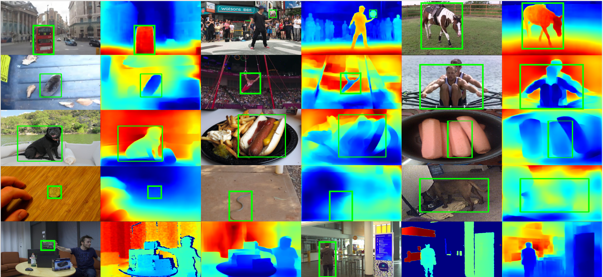
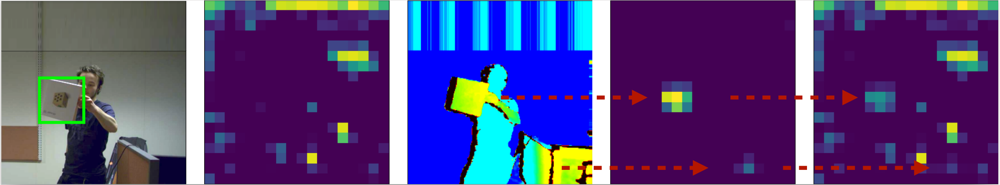
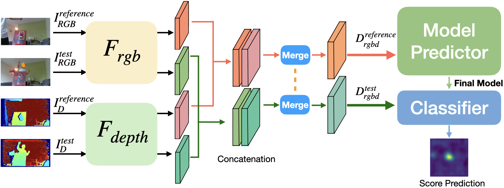
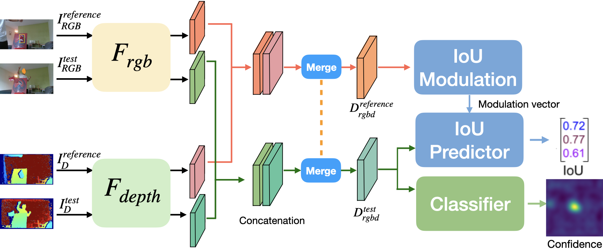

# DeT and DOT
Code and datasets for 

1) "DepthTrack: Unveiling the Power of RGBD Tracking" (ICCV2021)
2) "Depth-only Object Tracking" (BMVC2021)

```
@InProceedings{yan2021det,
    author    = {Yan, Song and Yang, Jinyu and Kapyla, Jani and Zheng, Feng and Leonardis, Ales and Kamarainen, Joni-Kristian},
    title     = {DepthTrack: Unveiling the Power of RGBD Tracking},
    booktitle = {Proceedings of the IEEE/CVF International Conference on Computer Vision (ICCV)},
    month     = {October},
    year      = {2021},
    pages     = {10725-10733}
}

@InProceedings{yan2021dot,
  title       = {Depth-only Object Tracking},
  author      = {Yan, Song and Yang, Jinyu and Leonardis, Ales and Kamarainen, Joni-Kristian},
  booktitle   = {Procedings of the British Machine Vision Conference (BMVC)},
  year        = {2021},
  organization= {British Machine Vision Association}
}
```


### DepthTrack Test set (50 Sequences) 
[Download](https://doi.org/10.5281/zenodo.5792146)

### DepthTrack Training set (150 Sequences)
Uploading ... (Monday)

### Generated LaSOT Depth Images
We manually remove bad sequences, and here are totally 646 sequences (some zip files may be broken, will be updated soon) used the **DenseDepth** method. 
Original DenseDepth outputs are in range [0, 1.0], we multiply 2^16.
Please check [LaSOT](http://vision.cs.stonybrook.edu/~lasot/) for RGB images and groundtruth.

[part01](https://doi.org/10.5281/zenodo.5482985),
[part02](https://doi.org/10.5281/zenodo.5484168), 
[part03](https://doi.org/10.5281/zenodo.5493447),
[part04](https://doi.org/10.5281/zenodo.5493615),
[part05](https://doi.org/10.5281/zenodo.5494482),
[part06](https://doi.org/10.5281/zenodo.5494485),
[part07](https://doi.org/10.5281/zenodo.5495242),
[part08](https://doi.org/10.5281/zenodo.5495246),
[part09](https://doi.org/10.5281/zenodo.5495249),
[part10](https://doi.org/10.5281/zenodo.5495255)

### Generated Got10K Depth Images
Uploading ... (Monday)

### Generated COCO Depth Images
Uploading .... (Monday)

## How to generate the depth maps for RGB benchmarks
We highly recommend to generate high quality depth data from the existing RGB tracking benchmarks,
such as [LaSOT](http://vision.cs.stonybrook.edu/~lasot/),
[Got10K](http://got-10k.aitestunion.com/),
[TrackingNet](https://tracking-net.org/), and
[COCO](https://cocodataset.org/#home).

We show the examples of generated depth here.
The first row is the results from [HighResDepth](http://yaksoy.github.io/highresdepth/) for LaSOT RGB images,
the second and the third are from [DenseDepth](https://github.com/ialhashim/DenseDepth) for Got10K and COCO RGB images,
the forth row is for the failure cases in which the targets are too close to the background or floor.
The last row is from DenseDepth for CDTB RGB images.



In our paper, we used the [DenseDepth](https://github.com/ialhashim/DenseDepth) monocular depth estimation method.
We calculate the Ordinal Error (ORD) on the generated depth for CDTB and our DepthTrack test set, and the mean ORD is about 0.386, which is sufficient for training D or RGBD trackers and we have tested it in our works.

And we also tried the recently [HighResDepth](http://yaksoy.github.io/highresdepth/) from CVPR2021, which also performs very well.

```
@article{alhashim2018high,
  title={High quality monocular depth estimation via transfer learning},
  author={Alhashim, Ibraheem and Wonka, Peter},
  journal={arXiv preprint arXiv:1812.11941},
  year={2018}
}

@inproceedings{miangoleh2021boosting,
  title={Boosting Monocular Depth Estimation Models to High-Resolution via Content-Adaptive Multi-Resolution Merging},
  author={Miangoleh, S Mahdi H and Dille, Sebastian and Mai, Long and Paris, Sylvain and Aksoy, Yagiz},
  booktitle={Proceedings of the IEEE/CVF Conference on Computer Vision and Pattern Recognition},
  pages={9685--9694},
  year={2021}
}
```


The generated depth maps by using **HighResDepth** will be uploaded soon.

If you find some excellent methods to generate high quality depth images, please share it.

### Architecture
The settings are same as that of Pytracking, please read the document of Pytracking for details.

Actually the network architecture is very simple, just adding one ResNet50 feature extractor for Depth input and then merging the RGB and Depth feature maps.
Below figures are
1) the feature maps for RGB, D inputs and the merged RGBD ones,
2) the network for RGBD DiMP50, and
3) RGBD ATOM.






### Download
1) Download the training dataset(70 sequences) of VOT2021RGBD Challenge from Zenodo (DepthTrack RGBD Tracking Benchmark) and edit the path in local.py
More data will be uploaded soon, we hope to bring a large scale RGBD training dataset.
```
http://doi.org/10.5281/zenodo.4716441
```

2) Download the checkpoints for DeT trackers (in install.sh)
```
gdown https://drive.google.com/uc\?id\=1djSx6YIRmuy3WFjt9k9ZfI8q343I7Y75 -O pytracking/networks/DeT_DiMP50_Max.pth
gdown https://drive.google.com/uc\?id\=1JW3NnmFhX3ZnEaS3naUA05UaxFz6DLFW -O pytracking/networks/DeT_DiMP50_Mean.pth
gdown https://drive.google.com/uc\?id\=1wcGJc1Xq_7d-y-1nWh6M7RaBC1AixRTu -O pytracking/networks/DeT_DiMP50_MC.pth
gdown https://drive.google.com/uc\?id\=17IIroLZ0M_ZVuxkGN6pVy4brTpicMrn8 -O pytracking/networks/DeT_DiMP50_DO.pth
gdown https://drive.google.com/uc\?id\=17aaOiQW-zRCCqPePLQ9u1s466qCtk7Lh -O pytracking/networks/DeT_ATOM_Max.pth
gdown https://drive.google.com/uc\?id\=15LqCjNelRx-pOXAwVd1xwiQsirmiSLmK -O pytracking/networks/DeT_ATOM_Mean.pth
gdown https://drive.google.com/uc\?id\=14wyUaG-pOUu4Y2MPzZZ6_vvtCuxjfYPg -O pytracking/networks/DeT_ATOM_MC.pth
```

### Install
```
bash install.sh path-to-anaconda DeT
```

### Train
Using the default DiMP50 or ATOM pretrained checkpoints can reduce the training time.

For example, move the default dimp50.pth into the checkpoints folder and rename as DiMPNet_Det_EP0050.pth.tar

```
python run_training.py bbreg DeT_ATOM_Max
python run_training.py bbreg DeT_ATOM_Mean
python run_training.py bbreg DeT_ATOM_MC

python run_training.py dimp DeT_DiMP50_Max
python run_training.py dimp DeT_DiMP50_Mean
python run_training.py dimp DeT_DiMP50_MC
```

### Test
```
python run_tracker.py atom DeT_ATOM_Max --dataset_name depthtrack --input_dtype rgbcolormap
python run_tracker.py atom DeT_ATOM_Mean --dataset_name depthtrack --input_dtype rgbcolormap
python run_tracker.py atom DeT_ATOM_MC --dataset_name depthtrack --input_dtype rgbcolormap

python run_tracker.py dimp DeT_DiMP50_Max --dataset_name depthtrack --input_dtype rgbcolormap
python run_tracker.py dimp DeT_DiMP50_Mean --dataset_name depthtrack --input_dtype rgbcolormap
python run_tracker.py dimp DeT_DiMP50_MC --dataset_name depthtrack --input_dtype rgbcolormap


python run_tracker.py dimp dimp50 --dataset_name depthtrack --input_dtype color
python run_tracker.py atom default --dataset_name depthtrack --input_dtype color

```
